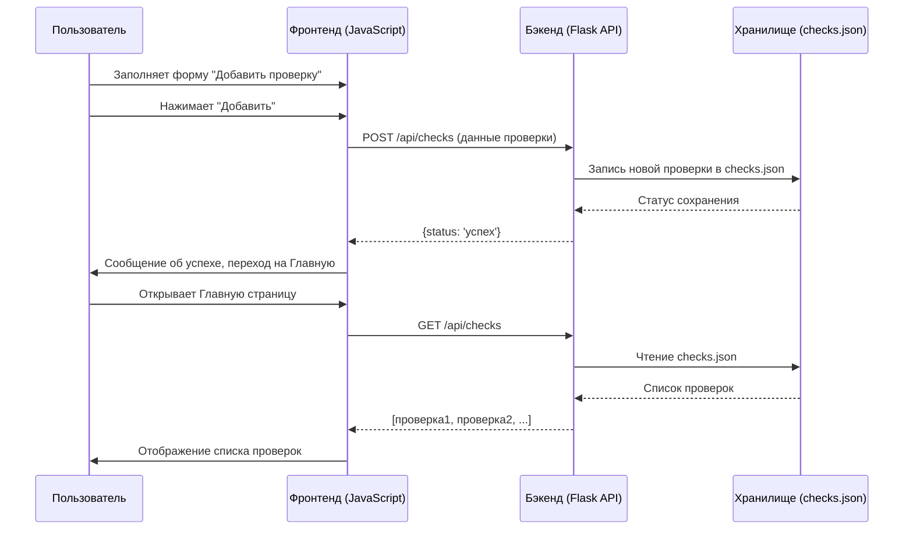

# План Проекта "Web Monitor"

## I. Предлагаемый Технологический Стек

*   **Бэкенд (Backend):**
    *   **Язык/Фреймворк:** Python с использованием Flask.
        *   *Обоснование:* Python отлично подходит для задач веб-скрапинга благодаря наличию мощных библиотек (`requests`, `BeautifulSoup`). Flask – легковесный и гибкий фреймворк.
*   **Фронтенд (Frontend):**
    *   **Технологии:** Чистый JavaScript (Vanilla JS), HTML, CSS.
        *   *Обоснование:* Для описанного интерфейса на начальном этапе достаточен чистый JavaScript, что упростит структуру проекта. HTML-файлы, предоставленные пользователем, будут служить основой (после удаления стороннего JS-кода и полей авторизации).
*   **Хранение Данных:**
    *   **Формат:** JSON-файлы.
        *   *Обоснование:* Соответствует запросу пользователя для простоты разработки и развертывания на начальном этапе.
*   **Планировщик Задач (для периодических проверок):**
    *   **Библиотека:** APScheduler (для Python).
        *   *Обоснование:* Хорошо интегрируется с Flask-приложениями.
*   **Интеграция с Telegram (для уведомлений):**
    *   **Библиотека:** `python-telegram-bot` (или аналогичная).
        *   *Обоснование:* Популярная и хорошо документированная библиотека. (Создание бота не входит в план).
*   **Логирование:**
    *   **Модуль:** Стандартный модуль `logging` в Python.
        *   *Обоснование:* Гибкая настройка логирования.

## II. Базовая Структура Проекта

```
web_monitor/
├── app.py                   # Главный файл Flask-приложения
├── monitor_engine.py        # Логика мониторинга
├── scheduler_tasks.py       # Задачи планировщика
├── telegram_sender.py       # Отправка уведомлений в Telegram
├── data_manager.py          # Управление данными (JSON)
├── data/
│   ├── checks.json          # Конфигурации проверок
│   └── history/             # История проверок
├── static/
│   ├── css/
│   │   └── style.css
│   └── js/
│       └── main.js
├── templates/
│   ├── index.html
│   ├── add_check.html
│   └── monitor_details.html
├── logs/
│   └── app.log
└── README.md
```

## III. План Реализации Первых Ключевых Функций

**A. Функция 1: Добавление Новой Проверки**

1.  **Бэкенд (`app.py`, `data_manager.py`):**
    *   API эндпоинт `POST /api/checks`.
    *   Валидация входных данных.
    *   Логика в `data_manager.py` для добавления новой проверки в `data/checks.json`.
2.  **Фронтенд (HTML [`add_check.html`](add-check.html), `static/js/main.js`):**
    *   Форма с полями: Название, URL, CSS-селектор, % изменения, Интервал.
    *   JavaScript для сбора данных, клиентской валидации и отправки POST-запроса.

**B. Функция 2: Отображение Сохраненных Проверок на "Головной Странице"**

1.  **Бэкенд (`app.py`, `data_manager.py`):**
    *   API эндпоинт `GET /api/checks` для получения списка проверок из `data/checks.json`.
2.  **Фронтенд (HTML [`index.html`](index.html), `static/js/main.js`):**
    *   JavaScript для GET-запроса на `/api/checks` при загрузке страницы.
    *   Динамическое отображение списка проверок.
    *   Раздел "Состояние системы" с данными от `GET /api/system-status`.

**Диаграмма Последовательности (Mermaid) для Добавления и Отображения Проверок:**



## IV. Уточнение по Развертыванию на Railway

*   Предложенный стек (Python/Flask, JSON, APScheduler) совместим с Railway.
*   **Важно:** Файловая система на PaaS (включая Railway) часто эфемерна. Данные в JSON-файлах и локальные логи могут быть потеряны при перезапусках.
*   **Решение:** На начальном этапе JSON-файлы приемлемы. Для долгосрочного надежного хранения данных на Railway потребуется переход на управляемую базу данных (например, PostgreSQL), что будет запланировано как отдельная задача по улучшению. Логирование также следует интегрировать с инструментами Railway.